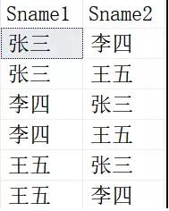
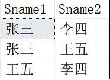
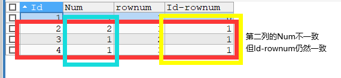
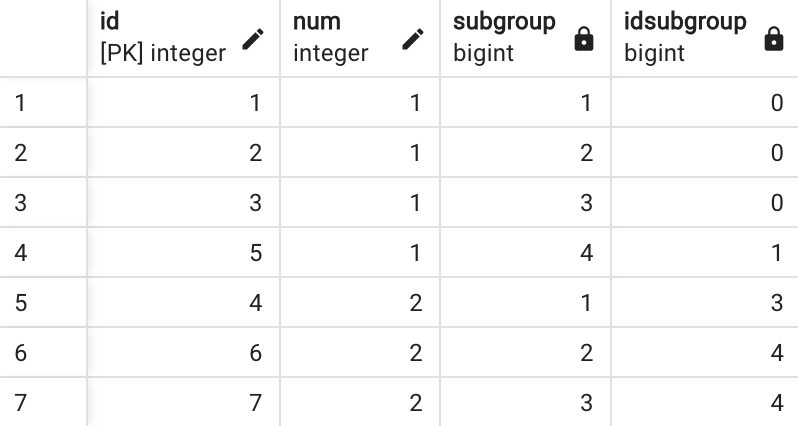
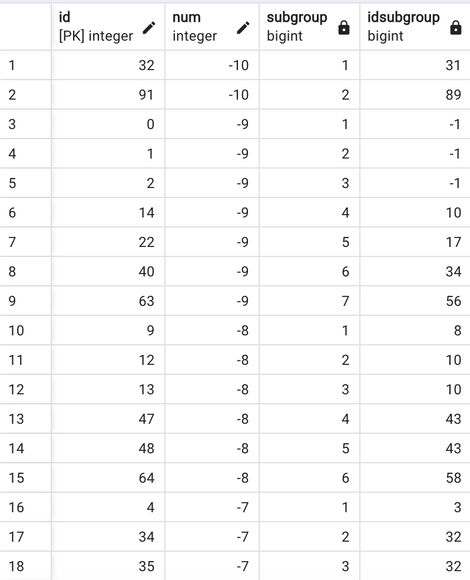

[TOC]

## Easy

### [175. Combine Two Tables](https://leetcode.com/problems/combine-two-tables/)

关键点：join两个表

```sql
SELECT p1.firstName, p1.lastName, a1.city, a1.state
FROM Person p1
LEFT JOIN Address a1
ON p1.personId = a1.personId;
```

### [181. Employees Earning More Than Their Managers](https://leetcode.com/problems/employees-earning-more-than-their-managers/)

关键点：inner join，注意命名使得代码语义更加清晰

```sql
SELECT e.name AS Employee
FROM Employee e
INNER JOIN Employee m
ON e.managerId = m.id
WHERE e.salary > m.salary;
```

### [182. Duplicate Emails](https://leetcode.com/problems/duplicate-emails/)

关键点：注意having和where的区别，group by后边使用having

```sql
SELECT email AS Email
FROM Person
GROUP BY email
HAVING COUNT(*) > 1;
```

### [183. Customers Who Never Order](https://leetcode.com/problems/customers-who-never-order/)

关键点：not in后边应该跟select子查询，而不是具体的某一列

```sql
-- 第一种方法，使用not in
SELECT name AS Customers
FROM Customers
WHERE Customers.id NOT IN (SELECT customerId FROM Orders);
```

```sql
# 第二种方法，左连接，选择右侧为空的
SELECT c.name AS Customers 
FROM Customers c LEFT JOIN Orders o 
ON c.id=o.customerId 
WHERE o.customerId IS NULL;
```

### [196. Delete Duplicate Emails](https://leetcode.com/problems/delete-duplicate-emails/)

关键点：自连接的原理，delete语句的写法

```sql
# 第一种写法
DELETE p2
FROM Person p1
INNER JOIN Person p2
ON p1.email = p2.email
WHERE p2.id > p1.id;
```

```sql
# 第二种写法
DELETE p1 
FROM Person p1, Person p2
WHERE p1.Email = p2.Email AND p1.Id > p2.Id;
```

```sql
-- 可能只能在SQL中运行，MySQL不行
DELETE FROM Person
WHERE Person.email > (
    SELECT MIN(p2.id)
    FROM Person p2
    WHERE p2.email = Person.email
);
```

#### 如何理解SQL中的自查询？

自连接是两张表结构和数据内容完全相同的表，在做处理时，我们通常会给他们分别重命名来加以区分，然后进行关联。自连接实际上涉及的是同一张表的两个不同实例。

示例表内容：

有如下一张表Student，结构和数据如下：


当我们进行自连接时，不加任何过滤条件，具体如下：

```sql
SELECT  
s1.Sname AS Sname1,
s2.Sname AS Sname2
FROM Student s2,Student s1
```

得到的结果是这样的，其实就是类似于数学上的排列：


我们常见的自连接是有条件的，实际上是在上边的结果上进行过滤。

比如我们想得到一一对应的数据：

```sql
SELECT  
s1.Sname AS Sname1,
s2.Sname AS Sname2
FROM Student s2,Student s1
WHERE s1.Sname=s2.Sname
```

得到的结果就是两个自连接的表一一对应：


这里就是自连接的精髓，张三自己和自己进行了关联。

但是在工作中，使用自连接的目的不是和自己关联，而是和表中的其他进行组合：

```sql
SELECT  
s1.Sname AS Sname1,
s2.Sname AS Sname2
FROM Student s2,Student s1
WHERE s1.Sname<>s2.Sname
```



此外，如果我们想进一步除掉重复的数据行，比如（张三，李四）和（李四，张三）。

```sql
SELECT  
s1.Sname AS Sname1,
s2.Sname AS Sname2
FROM Student s2,Student s1
WHERE s1.Sname>s2.Sname
```



现在我们删除如下表中重复的数据行，应该如何书写？


我们可以发现这个表没有主键，因此我们可以使用自增长函数INDENTIFY()来生成一个类似于自增主键的ID，并将结果插入到Student_Tmp中：

```sql
SELECT 
IDENTITY(INT) ID,
Sname,
Score
INTO Student_Tmp
FROM Student
```

> Note: SELECT INTO是一种用于将查询的结果插入到新表中的语句
>
> ```sql
> SELECT column1, column2
> INTO new_table
> FROM existing_table
> WHERE condition;
> ```

我们使用自增长函数来生成了一个类似于自增主键的ID，并且将结果插入到Student_Tmp，其中具体内容如下：


然后我们可以通过保留最大值或者最小值的方法来删除重复项。

```sql
DELETE FROM Student_Tmp
WHERE Student_Tmp.ID< (
            SELECT Max(s2.ID)
            FROM Student_Tmp s2
            WHERE Student_Tmp.Sname=s2.Sname
            AND Student_Tmp.Score=s2.Score
);
```

DELETE 语句有一个问题，因为 DELETE 语句不支持给表指定别名。要删除表中满足条件的行，你需要直接引用表名，而不是使用别名。

### [197. Rising Temperature](https://leetcode.com/problems/rising-temperature/)

关键点：自连接挑选，注意datediff(date1, date2)是date1-date2.

```sql
-- 第一种写法
SELECT w1.id
FROM Weather w1
JOIN Weather w2
ON DATEDIFF(w1.recordDate, w2.recordDate) = 1
WHERE w1.temperature > w2.temperature;
```

```sql
-- 自连接的特色写法
SELECT w1.id
FROM Weather w1, Weather w2
WHERE DATEDIFF(w1.recordDate, w2.recordDate) = 1 AND w1.temperature > w2.temperature;
```

### [511. Game Play Analysis I](https://leetcode.com/problems/game-play-analysis-i/)

```sql
SELECT player_id, MIN(event_date) AS first_login
FROM Activity
GROUP BY player_id;
```

### [577. Employee Bonus](https://leetcode.com/problems/employee-bonus/)

关键点：没有注意审题，没有注意NULL的判断；使用了JOIN而不是LEFT JOIN，没有思考到有可能Bonus只存在部分雇员的bonus，所以还是审题问题。

```sql
SELECT e.name, b.bonus
FROM Employee e
LEFT JOIN Bonus b
ON e.empId = b.empId
WHERE b.bonus < 1000 OR b.bonus IS NULL;
```

### [584. Find Customer Referee](https://leetcode.com/problems/find-customer-referee/)

关键点：我们可以使用NOT IN代替!=来提高运行速度

```sql
SELECT name
FROM Customer
WHERE referee_id IS NULL OR referee_id != 2;
```

```sql
SELECT name
FROM Customer
WHERE referee_id IS NULL OR referee_id NOT IN (2);
```

### [586. Customer Placing the Largest Number of Orders](https://leetcode.com/problems/customer-placing-the-largest-number-of-orders/)

关键点：思路很重要，既然只有一个是订单最多的，那么直接排序选第一个即可，注意ORDER BY COUNT的思路。

```sql
SELECT o1.customer_number
FROM Orders o1
GROUP BY o1.customer_number
ORDER BY COUNT(*) DESC
LIMIT 1;
```

### [595. Big Countries](https://leetcode.com/problems/big-countries/)

```sql
SELECT name, population, area
FROM World
WHERE area >= 3000000 OR population >= 25000000;
```

### [596. Classes More Than 5 Students](https://leetcode.com/problems/classes-more-than-5-students/)

```sql
SELECT class
FROM Courses
GROUP BY class
HAVING COUNT(*) >= 5;
```

### [607. Sales Person](https://leetcode.com/problems/sales-person/)

关键点：子查询，NOT IN

```sql
SELECT s1.name
FROM SalesPerson s1
WHERE s1.sales_id NOT IN (
    SELECT o1.sales_id
    FROM Orders o1
    JOIN Company c1
    ON o1.com_id = c1.com_id
    WHERE name = 'RED'
);
```

### [610. Triangle Judgement](https://leetcode.com/problems/triangle-judgement/)

关键点：Yes和No记得加引号，三角形判断的条件是任意三条边之和大于第三边

```sql
-- 使用CASE WHEN
SELECT x, y, z, (CASE WHEN x+y>z AND y+z>x AND x+z>y THEN 'Yes' ELSE 'No' END) AS triangle
FROM Triangle;
```

>Note: IF(condition, value_if_true, value_if_false)

```sql
-- 使用IF
SELECT *, IF(x+y>z AND y+z>x AND z+x>y, "Yes", "No") AS triangle 
FROM Triangle;
```

### [619. Biggest Single Number](https://leetcode.com/problems/biggest-single-number/)

关键点：SQL的执行顺序

```sql
-- 错误的代码，从每个出现一次的分组中选出了最大值，而不是所有出现一次的数字的最大值
SELECT MAX(num) AS num
FROM MyNumbers
GROUP BY num
HAVING COUNT(*) = 1;
```

```sql
-- 正确的写法，利用子查询，先找出只出现一次的数字，再选出最大值
SELECT MAX(num) AS num
FROM (
    SELECT num
    FROM MyNumbers
    GROUP BY num
    HAVING COUNT(*) = 1
) AS unique_nums;
```

> 当 SQL 查询被执行时，通常会遵循以下步骤，这些步骤构成了查询的执行顺序：
>
> 1. **FROM**：首先，执行 FROM 子句，该子句指定要从中检索数据的表或子查询。数据库引擎从这些表或子查询中获取所有的行和列。
> 2. **WHERE**：接下来，执行 WHERE 子句，该子句用于筛选在 FROM 子句中检索的数据。只有满足 WHERE 子句中条件的行才会被包含在结果中。
> 3. **GROUP BY**：如果查询包含 GROUP BY 子句，则根据 GROUP BY 子句中指定的列对数据进行分组。
> 4. **HAVING**：如果查询包含 HAVING 子句，则根据 HAVING 子句中指定的条件对分组进行筛选。只有满足 HAVING 子句中条件的分组才会被包含在结果中。
> 5. **SELECT**：执行 SELECT 子句，该子句用于选择要返回的列，计算新的列，或者对数据进行聚合操作。
> 6. **ORDER BY**：如果查询包含 ORDER BY 子句，则根据 ORDER BY 子句中指定的列对结果进行排序。
> 7. **LIMIT/OFFSET**：最后，如果查询包含 LIMIT 或 OFFSET 子句，则根据这些子句来限制返回的行数或跳过指定数量的行。

此处还有一个需要注意的点就是，为什么不能使用limit 1来取最大值。题目的要求是“如果没有只出现一次的数字，就输出null”，也就是说，当我们查询的结果为空时，我们需要输出null。这里我们总结了一个表格（以下内容参考链接：https://leetcode.cn/problems/biggest-single-number/solutions/683252/dang-biao-ge-wei-kong-shi-ru-he-fan-hui-6qpzg）


此处需要强调的是，空表示表格没有任何输出，null表示输出为null。我们可以理解为表格中一行都没有（空）和表格中有记录但是值都是null。

我们使用如下的数据集：

```sql
CREATE TABLE IF NOT EXISTS my_numbers (num INT);
TRUNCATE TABLE my_numbers
INSERT INTO my_numbers (num) VALUES ('8');
INSERT INTO my_numbers (num) VALUES ('8');
INSERT INTO my_numbers (num) VALUES ('3');
INSERT INTO my_numbers (num) VALUES ('3');
INSERT INTO my_numbers (num) VALUES ('4');
INSERT INTO my_numbers (num) VALUES ('4');
INSERT INTO my_numbers (num) VALUES ('5');
INSERT INTO my_numbers (num) VALUES ('5');
```


1. 使用聚合函数对空值进行处理时，SUM/AVG/MAX/MIN都会返回null值。首先我们根据题意，给出一个无法输出null的代码：

   ```sql
   #代码1.1
       select num
       from my_numbers 
       group by num
       having count(num)=1
       order by num desc
       limit 0,1
   ```

   返回的表格为空

   这时我们在外层加一个select尝试聚合函数：

   ```sql
   SELECT SUM(num) sum_num, AVG(num) avg_num, MAX(num) max_num,MIN(num) min_num
   FROM (
   	SELECT num
   	FROM my_numbers 
   	GROUP BY num
   	HAVING COUNT(num)=1
   	ORDER BY num DESC
   	LIMIT 0,1
   ) t1
   ```

   得到的结果可以返回null值，也就是说，只要表格为空，加入任何聚合函数，我们都可以得到null的结果。：

   

2. 使用ifnull对空值进行处理，实际上不是ifnull起作用。

   ```sql
   #代码2.1
   select ifnull((select max(num)
   from my_numbers
   group by num
   having count(*) = 1
   Order by num DESC
   limit 1), null) num
   ```

   实际上我们不建议使用ifnull来处理并输出null值，原因如下：

   - ifnull函数定位：用于判断第一个表达式是否为null，如果为null就返回第二个参数的值，如果不为null就返回第一个参数的值。

     ```sql
     IFNULL(expression, alt_value)
     ```

     这就意味着，如果expression为null，才会返回alt_value的值。按照ifnull函数的运行逻辑，要使得代码能够输出alt_value，其实expression本身就应该为null值，然而根据上边的代码，我们知道ifnull的第一个参数实际上为空，函数ifnull其实没有起到任何作用。那么我们可能会有疑问，是否ifnull的第一个参数为空时，仍然可以输出第二个参数的值？

     ```sql
     #代码2.2
     SELECT IFNULL(t1.num,NULL) ifnull_num
     FROM(
     	SELECT num
     	FROM my_numbers 
     	GROUP BY num
     	HAVING COUNT(num)=1
     	ORDER BY num DESC
     	LIMIT 0,1
     ) t1
     ```

     此时输出的结果仍然为空：

     

     那么为什么代码2.1和2.2输出的结果不同？其实差别在select语句上。

     3. 使用select对空值进行处理，观察代码2.1可以发现，代码1.1的结构被放在了select语句中，而不是from语句中，这样的放置会导致最后的结果不同。

        ```sql
        #代码3.1 将代码1.1放置在from后，再从虚拟表中选择num
        SELECT num
        FROM(
        	SELECT num
        	FROM my_numbers 
        	GROUP BY num
        	HAVING COUNT(num)=1
        	ORDER BY num DESC
        	LIMIT 0,1
        ) t1
        ```

        

        可以发现，如果这样排列我们的代码，我们得到的值仍然为空，但是如果我们将整块代码写在select中：

        ```sql
        #代码3.2 将代码1.1直接放置在select中
        SELECT(
        	SELECT num
        	FROM my_numbers 
        	GROUP BY num
        	HAVING COUNT(num)=1
        	ORDER BY num DESC
        	LIMIT 0,1
        ) select_num
        ```

        

        我们得到了null值，因此如果我们在select语句中写入空值，直接运行select语句，我们将会得到null值。

        总结：

        - select 空 param1 -> param1：null
        - select param1 from 空 —> param1：空

     4. limit语句不会输出新的null值，除非表格中本身就存在null值，因为limit语句对表格只是进行截取，如我们的代码1.1所示，输出值为空，也印证了这一点。

     5. where语句所带来的限制条件并不会输出新的null值，除非表格中本身就存在null，同理having也一样。这里我们可以测试一下：

        ```sql
        #代码5.1
        SELECT num
        FROM my_numbers 
        WHERE num IS NULL
        ```

        从我们的测试集中，我们知道数据是不包含null值的，那么在这样的条件下，我们的输出依旧为空。

        

        也就是说，当数据库中无法匹配当前条件时，输出的数据行是空而非null的。

     总结：

     - 可以使用聚合函数进行空值null值的转换，具体的聚合函数包括SUM/AVG/MAX/MIN
     - 可以使用select语句进行转换，但空值应直接写在select中而非from中
     - limit语句无法出现新的null值
     - where和having同样无法出现新的null值

### [620. Not Boring Movies](https://leetcode.com/problems/not-boring-movies/)

```sql
SELECT *
FROM Cinema
WHERE id % 2 = 1 AND description != "boring"
ORDER BY rating DESC;
```

```sql
SELECT *
FROM Cinema
WHERE MOD(id, 2) = 1 AND description != "boring"
ORDER BY rating DESC;
```

> Note: is not 和!=的区别在于， !=用于两个非null值不相等时返回true , is not 通常用于特殊比较is not null ； is not true。
> 例如：
> select true is not true #会返回0
> select false is not true #会返回1 

### [627. Swap Salary](https://leetcode.com/problems/swap-salary/)

关键点：UPDATE，CASE WHEN, IF

> CASE
>     WHEN condition1 THEN value1
>     WHEN condition2 THEN value2
>     ...
>     ELSE default_value
> END

```sql
UPDATE Salary
SET sex = (CASE WHEN sex='f' THEN 'm' ELSE 'f' END);
```

> UPDATE table_name
> SET column1 = value1, column2 = value2, ...
> WHERE condition;

```sql
UPDATE Salary
SET sex = IF(sex='f', 'm', 'f');
```

> IF(condition, value_if_true, value_if_false)

### [1050. Actors and Directors Who Cooperated At Least Three Times](https://leetcode.com/problems/actors-and-directors-who-cooperated-at-least-three-times/)

```sql
SELECT actor_id, director_id
FROM ActorDirector
GROUP BY actor_id, director_id
HAVING COUNT(*) >= 3;
```

### [1068. Product Sales Analysis I](https://leetcode.com/problems/product-sales-analysis-i/)

```sql
SELECT s.year, s.price, p.product_name
FROM Sales s
LEFT JOIN Product p
ON s.product_id = p.product_id;
```

### [1075. Project Employees I](https://leetcode.com/problems/project-employees-i/)

```sql
SELECT p.project_id, ROUND(AVG(e.experience_years), 2) AS average_years
FROM Project p
LEFT JOIN Employee e
ON p.employee_id = e.employee_id
GROUP BY p.project_id;
```

### [1084. Sales Analysis III](https://leetcode.com/problems/sales-analysis-iii/)

关键点：需要所有的订单都是在时间范围内的

```sql
SELECT p.product_id, p.product_name
FROM Product p
JOIN Sales s
ON p.product_id = s.product_id
GROUP BY p.product_id
HAVING MIN(s.sale_date) >= '2019-01-01' AND MAX(s.sale_date) <= '2019-03-31';
```

### [1141. User Activity for the Past 30 Days I](https://leetcode.com/problems/user-activity-for-the-past-30-days-i/)

关键点：DISTINCT，查阅30天活跃用户数量。注意边界值的设定，假如说规定一天，那就是>=0, <1，因为只有7-27当天；同理，<30 AND >= 0。

```sql
SELECT activity_date AS day, COUNT(DISTINCT user_id) AS active_users
FROM Activity
WHERE DATEDIFF('2019-07-27', activity_date) < 30 
			AND DATEDIFF('2019-07-27', activity_date) >= 0
GROUP BY activity_date;
```

### [1148. Article Views I](https://leetcode.com/problems/article-views-i/)

```sql
SELECT DISTINCT author_id AS id
FROM Views
WHERE author_id = viewer_id
ORDER BY id ASC;
```

### [1179. Reformat Department Table](https://leetcode.com/problems/reformat-department-table/)

关键点：行转列写法，CASE WHEN/IF函数的用法，聚合函数

```sql
SELECT id, 
SUM(CASE WHEN month='Jan' THEN revenue END) AS Jan_Revenue,
SUM(CASE WHEN month='Feb' THEN revenue END) AS Feb_Revenue,
SUM(CASE WHEN month='Mar' THEN revenue END) AS Mar_Revenue,
SUM(CASE WHEN month='Apr' THEN revenue END) AS Apr_Revenue,
SUM(CASE WHEN month='May' THEN revenue END) AS May_Revenue,
SUM(CASE WHEN month='Jun' THEN revenue END) AS Jun_Revenue,
SUM(CASE WHEN month='Jul' THEN revenue END) AS Jul_Revenue,
SUM(CASE WHEN month='Aug' THEN revenue END) AS Aug_Revenue,
SUM(CASE WHEN month='Sep' THEN revenue END) AS Sep_Revenue,
SUM(CASE WHEN month='Oct' THEN revenue END) AS Oct_Revenue,
SUM(CASE WHEN month='Nov' THEN revenue END) AS Nov_Revenue,
SUM(CASE WHEN month='Dec' THEN revenue END) AS Dec_Revenue
FROM department
GROUP BY id
ORDER BY id;
```

```sql
SELECT id,
    MAX(IF(`month`='Jan',revenue,NULL)) Jan_Revenue,
    MAX(IF(`month`='Feb',revenue,NULL)) Feb_Revenue,
    MAX(IF(`month`='Mar',revenue,NULL)) Mar_Revenue,
    MAX(IF(`month`='Apr',revenue,NULL)) Apr_Revenue,
    MAX(IF(`month`='May',revenue,NULL)) May_Revenue,
    MAX(IF(`month`='Jun',revenue,NULL)) Jun_Revenue,
    MAX(IF(`month`='Jul',revenue,NULL)) Jul_Revenue,
    MAX(IF(`month`='Aug',revenue,NULL)) Aug_Revenue,
    MAX(IF(`month`='Sep',revenue,NULL)) Sep_Revenue,
    MAX(IF(`month`='Oct',revenue,NULL)) Oct_Revenue,
    MAX(IF(`month`='Nov',revenue,NULL)) Nov_Revenue,
    MAX(IF(`month`='Dec',revenue,NULL)) Dec_Revenue
FROM Department 
GROUP BY id;
```

重写部门表格，部门id和每个月的收入。部门id可以通过GROUP BY方法，根据部门id来统计收入时，中间需要有这样一步，SQL每次执行查询，除了统计该月份有的数据，还会统计其他月份，它们都是NULL。所以最后还需要一个聚合函数（SUM/MAX）来把每次查询的数据按照id汇总，这才是月收入。

此处我们举个例子了解一下SQL语句查询的执行步骤：

```sql
SELECT col_1, col_2, COUNT(*) as num                  #顺序5
FROM table_1 JOIN table_2 ON table_1.id = table_2.id  #顺序1
WHERE col_3 > 2.90                                    #顺序2
GROUP BY table_1.id                                   #顺序3
HAVING num > 2                                        #顺序4
ORDER BY num DESC                                     #顺序6
LIMIT 2                                               #顺序7
```


如果不使用聚合函数，我们看到的就是步骤2这样的表，但是这显然不符合分组要求，就会报错。所以最后要使用sum或者MAX来聚合。

那么现在来到另一个问题，如何理解GROUP BY和聚合函数。

我们不能写成select * from Table group by id，为什么不能用*而是一定要用某个列的聚合函数呢。这是因为，在分组之后，单元格中会存在多个值，关系数据库是基于关系的，单元格中不允许存在多个值，因此会报错。

### [1211. Queries Quality and Percentage](https://leetcode.com/problems/queries-quality-and-percentage/)

关键点：SUM和COUNT还是分不清，query_name可能存在NULL

```sql
-- 规范写法，使用CASE WHEN或者IF
SELECT query_name, ROUND(AVG(rating/position), 2) AS quality, ROUND(SUM(IF(rating<3, 1, 0))*100/COUNT(*), 2) AS poor_query_percentage
FROM Queries
WHERE query_name IS NOT NULL
GROUP BY query_name;
```

```sql
-- 简略写法
SELECT query_name, ROUND(AVG(rating/position), 2) AS quality, ROUND(SUM(rating<3)*100/COUNT(*), 2) AS poor_query_percentage
FROM Queries
WHERE query_name IS NOT NULL
GROUP BY query_name;
```

```sql
-- 使用AVG
SELECT query_name, ROUND(AVG(rating/position), 2) AS quality, ROUND(AVG(rating < 3) * 100, 2) AS poor_query_percentage
FROM Queries
WHERE query_name IS NOT NULL
GROUP BY query_name;
```

不能直接COUNT(rating<3)，因为rating<3返回的结果为true或者false，不能直接计数

### [1484. Group Sold Products By The Date](https://leetcode.com/problems/group-sold-products-by-the-date/)

关键点：使用GROUP_CONCAT()进行字符串拼接，注意两个distinct

```sql
SELECT 
    sell_date,
    COUNT(DISTINCT product) AS num_sold,
    GROUP_CONCAT(DISTINCT product ORDER BY product SEPARATOR ',') AS products
FROM 
    Activities
GROUP BY 
    sell_date;
```

> Note: GROUP_CONCAT(expression [ORDER BY expression] [SEPARATOR separator])

此处我们对product进行拼接，并按照product的字典序排序。

### [1251. Average Selling Price](https://leetcode.com/problems/average-selling-price/)

关键点：LEFT JOIN，IFNULL添加的位置不正确，一开始添加在了SUM的内层

```sql
SELECT p.product_id, IFNULL(ROUND(SUM(p.price*u.units)/SUM(u.units), 2), 0) AS average_price
FROM Prices p
LEFT JOIN UnitsSold u
ON p.product_id = u.product_id AND u.purchase_date >= p.start_date AND u.purchase_date <= p.end_date
GROUP BY p.product_id;
```

### [1280. Students and Examinations](https://leetcode.com/problems/students-and-examinations/)

关键点：JOIN最好写全称笛卡尔积CROSS JOIN，而且，用错了聚合函数！我对id进行了sum，这显然是大错特错，应该返回的是行数之和！而且count对NULL行不计数。

```sql
-- 第一种写法，先全连接再左连接
SELECT stu.student_id, stu.student_name, sub.subject_name, COUNT(exam.student_id) AS attended_exams
FROM Students stu
JOIN Subjects sub
LEFT JOIN Examinations exam
ON stu.student_id = exam.student_id AND sub.subject_name = exam.subject_name
GROUP BY stu.student_id, sub.subject_name
ORDER BY stu.student_id, sub.subject_name;
```

```sql
-- 第二种写法，
SELECT s.student_id, s.student_name, sub.subject_name, COALESCE(e.attended_exams, 0) AS attended_exams
FROM Students s
CROSS JOIN Subjects sub
LEFT JOIN (
    SELECT student_id, subject_name, COUNT(*) AS attended_exams
    FROM Examinations
    GROUP BY student_id, subject_name
) e ON s.student_id = e.student_id AND sub.subject_name = e.subject_name
ORDER BY s.student_id, sub.subject_name;
```

> Note: COALESCE 是 SQL 中的一个函数，用于处理 NULL 值。它接受多个参数，并返回参数列表中的第一个非 NULL 值。如果所有参数都是 NULL，则返回 NULL。
>
> ```sql
> COALESCE(value1, value2, ...)
> ```

首先从Examinations表分组算出每个人参加每个考试的次数，再进行JOIN。

### [1327. List the Products Ordered in a Period](https://leetcode.com/problems/list-the-products-ordered-in-a-period/)

关键点：闰年是能被4整除但不能被100整除，或者能被400整除。

```sql
SELECT p.product_name, SUM(o.unit) AS unit
FROM Products p
JOIN Orders o
ON p.product_id = o.product_id
WHERE o.order_date BETWEEN '2020-02-01' AND '2020-02-29'
GROUP BY p.product_id
HAVING SUM(o.unit) >= 100;
```

### [1378. Replace Employee ID With The Unique Identifier](https://leetcode.com/problems/replace-employee-id-with-the-unique-identifier/)

```sql
SELECT e2.unique_id, e1.name
FROM Employees e1
LEFT JOIN EmployeeUNI e2
ON e1.id = e2.id;
```

### [1407. Top Travellers](https://leetcode.com/problems/top-travellers/)

```sql
SELECT u.name, SUM(IFNULL(r.distance, 0)) AS travelled_distance
FROM Users u
LEFT JOIN Rides r
ON u.id = r.user_id
GROUP BY r.user_id
ORDER BY travelled_distance DESC, u.name ASC;
```

此处我们在SUM中使用IFNULL判断是否为空，如果为空则设为0.

### [1517. Find Users With Valid E-Mails](https://leetcode.com/problems/find-users-with-valid-e-mails/)

```sql
SELECT product_id
FROM Products
WHERE low_fats = 'Y' AND recyclable = 'Y';
```

### [1587. Bank Account Summary II](https://leetcode.com/problems/bank-account-summary-ii/)

```sql
SELECT u.name, SUM(amount) AS balance
FROM Users u
LEFT JOIN Transactions t
ON u.account = t.account
GROUP BY u.account
HAVING SUM(t.amount) > 10000;
```

这里实际上HAVING已经进行筛选了，并且如果一列中存在NULL值，SUM直接不对该行进行加和，也就是说，SUM能够很好地处理NULL值的情况，所以这里可以不使用IFNULL。

### [1633. Percentage of Users Attended a Contest](https://leetcode.com/problems/percentage-of-users-attended-a-contest/)

```sql
SELECT contest_id, ROUND(COUNT(user_id) * 100 / (SELECT COUNT(*) FROM Users), 2) AS percentage
FROM Register
GROUP BY contest_id
ORDER BY percentage DESC, contest_id ASC;
```

### [1661. Average Time of Process per Machine](https://leetcode.com/problems/average-time-of-process-per-machine/)

```sql
SELECT machine_id, 
    ROUND(SUM(CASE WHEN activity_type = 'start' THEN (-1)*timestamp ELSE timestamp END) * 2 / COUNT(*), 3) AS processing_time
FROM Activity
GROUP BY machine_id;
```

我感觉我的方法比自连接好捏～

### [1517. Find Users With Valid E-Mails](https://leetcode.com/problems/find-users-with-valid-e-mails/)

关键点：正则表达式，转义字符在mysql中是两个斜杠

`REGEXP`是正则表达式的意思：

- ^表示以后边的字符为开头
- []表示括号内任意字符
  - [0-9]表示一个字符范围，匹配从0到9的任何字符
  - [^a-z]：这个变量匹配不在a到z范围内的任何字符，^用来否定字符范围，它在方括号内的含义与方括号外表示开始的含义不同
- -表示连续
- *表示重复前边任意字符任意次数
  - [a-z]*表示一个字符范围，匹配从a到z的任何字符0次或多次
  - [a-z]+表示一个字符范围，匹配从a到z的任何字符1次或多次
- .匹配任何一个字符
- \用来转义后面的特殊字符
- $表示以前面的字符结尾

```sql
SELECT *
FROM users
WHERE mail REGEXP '^[a-zA-Z][a-zA-Z0-9\\_\\.\\-]*\\@leetcode\\.com$'
```

此处我们也转义了'@'字符，因为它们在正则表达式中具有特殊意义。正则需要前面加\，mysql需要加两个\，一个正则要的，一个mysql要的。

### [1527. Patients With a Condition](https://leetcode.com/problems/patients-with-a-condition/)

关键点：正则表达式

```sql
SELECT *
FROM PATIENTS
WHERE CONDITIONS REGEXP '^DIAB1|\\sDIAB1';
```

而前缀存在分为2种：

I 类糖尿病位于第一个时: 以DIAB1开始，即CONDITIONS REGEXP '^DIAB1'
I 类糖尿病不是第一个时: 含有空格DIAB1，即CONDITIONS REGEXP '\sDIAB1'
所以答案很明显了

用正则表达式来匹配这2种情况就行

位于第一个时，用 ^ 匹配输入字符串的开始位置，即^DIAB1
不是第一个时，又符合前缀所以它属于代码后段的首位，即前面有空格与代码首段隔开，用 \s 匹配一个被视为白空格的空格或字符；
但要注意的是：多数正则表达式实现使用单个反斜杠转义特殊字符，一遍能使用这些字符本身，但是MySQL要求两个反斜杠（MySQL自己解释一个，正则表达式库解释另一个），所以是\sDIAB1

然后这2种情况只要满足一种即可，所以用 |
| 管道符号用于指定匹配字符串时要使用的替代模式；在由竖线分隔的一行模式中，竖线被解释为OR，匹配过程从最左侧的模式开始，在找到第一个匹配项时停止

参考链接：https://leetcode.cn/problems/patients-with-a-condition/solutions/2166550/mysqlzheng-ze-biao-da-shi-jian-dan-yun-y-pfwq/
### [1667. Fix Names in a Table](https://leetcode.com/problems/fix-names-in-a-table/)

关键点：字符串函数

考察字符串函数的用法：

- `CONCAT(str1, str2) :` 拼接字符串
- `UPPER(str) :` 字符串变成大写
- `LOWER(str) :` 字符串变成小写
- `LENGTH(str) :` 获取字符串的长度
- `LEFT(str,len) :` 获取字符串左边 len 个字符
- `RIGHT(str,len) :` 获取字符串右边 len 个字符
- `SUBSTR(str,start,len) :` 获取 str 中从 start 开始的 len 个字符

```sql
SELECT user_id, CONCAT(UPPER(LEFT(name, 1)), LOWER(SUBSTR(name, 2))) as name
FROM Users
ORDER BY user_id;
```

### [1581. Customer Who Visited but Did Not Make Any Transactions](https://leetcode.com/problems/customer-who-visited-but-did-not-make-any-transactions/)

```sql
SELECT v.customer_id, COUNT(*) AS count_no_trans
FROM Visits v
WHERE visit_id NOT IN (SELECT visit_id FROM Transactions)
GROUP BY v.customer_id;
```

### [1683. Invalid Tweets](https://leetcode.com/problems/invalid-tweets/)

关键点：字符串长度，用char_length()也行

```sql
SELECT tweet_id
FROM Tweets
WHERE LENGTH(content) > 15;
```

### [1693. Daily Leads and Partners](https://leetcode.com/problems/daily-leads-and-partners/)

```sql
SELECT date_id, make_name, COUNT(DISTINCT lead_id) AS unique_leads, COUNT(DISTINCT partner_id) AS unique_partners
FROM DailySales
GROUP BY date_id, make_name;
```

### [1729. Find Followers Count](https://leetcode.com/problems/find-followers-count/)

```sql
SELECT user_id, COUNT(*) AS followers_count
FROM Followers
GROUP BY user_id
ORDER BY user_id;
```

### [1731. The Number of Employees Which Report to Each Employee](https://leetcode.com/problems/the-number-of-employees-which-report-to-each-employee/)

```sql
SELECT e2.employee_id, e2.name, COUNT(e1.employee_id) AS reports_count, ROUND(AVG(e1.age)) AS average_age
FROM Employees e1, Employees e2
WHERE e1.reports_to = e2.employee_id
GROUP BY e2.employee_id
ORDER BY e2.employee_id;
```

### [1741. Find Total Time Spent by Each Employee](https://leetcode.com/problems/find-total-time-spent-by-each-employee/)

```sql
SELECT event_day as day, emp_id, SUM(out_time - in_time) AS total_time
FROM Employees
GROUP BY event_day, emp_id;
```

### [2356. Number of Unique Subjects Taught by Each Teacher](https://leetcode.com/problems/number-of-unique-subjects-taught-by-each-teacher/)

```sql
SELECT teacher_id, COUNT(DISTINCT subject_id) AS cnt
FROM Teacher
GROUP BY teacher_id;
```

### [1789. Primary Department for Each Employee](https://leetcode.com/problems/primary-department-for-each-employee/)

关键点：使用UNION，当两种情况不好一起筛选时，或者使用subquery

```sql
SELECT employee_id, department_id
FROM Employee
WHERE primary_flag = 'Y'
UNION
SELECT employee_id, department_id
FROM Employee
GROUP BY employee_id
HAVING COUNT(*) = 1
```

```sql
SELECT DISTINCT employee_id, department_id
FROM Employee
WHERE employee_id IN (
    SELECT employee_id
    FROM Employee
    GROUP BY employee_id
    HAVING COUNT(*) = 1
  )
  OR primary_flag = 'Y'
ORDER BY employee_id;
```

### [1795. Rearrange Products Table](https://leetcode.com/problems/rearrange-products-table/)

关键点：行列互相转换，行转列使用SUM等聚合函数，列转行使用UNION。

1. 列转行

```sql
SELECT product_id, 'store1' AS store, store1 AS price FROM products WHERE store1 IS NOT NULL
UNION
SELECT product_id, 'store2' AS store, store2 AS price FROM products WHERE store2 IS NOT NULL
UNION
SELECT product_id, 'store3' AS store, store3 AS price FROM products WHERE store3 IS NOT NULL;
```

2. 列转行

```sql
SELECT 
  product_id,
  SUM(IF(store = 'store1', price, NULL)) 'store1',
  SUM(IF(store = 'store2', price, NULL)) 'store2',
  SUM(IF(store = 'store3', price, NULL)) 'store3' 
FROM
  Products1 
GROUP BY product_id ;
```


还有一点需要注意：group by 有一个原则,就是 select 后面的所有列中,没有使用聚合函数的列,必须出现在 group by 后面。

### [1873. Calculate Special Bonus](https://leetcode.com/problems/calculate-special-bonus/)

关键点：正则函数或者NOT LIKE

```sql
SELECT employee_id, (CASE WHEN name NOT REGEXP '^M' AND employee_id % 2 = 1 THEN salary ELSE 0 END) AS bonus
FROM Employees
ORDER BY employee_id;
```

或者使用`NOT LIKE "M%"`, CASE WHEN也可以换成IF，除此之外，还可以使用UNION，但是这里我觉得没有必要。

salary * ( employee_id%2 ) * ( name not like 'M%') as bonus 看到别人这个感觉挺巧妙，在 SQL 中，布尔表达式的结果通常是 1（表示True）或 0（表示False）。这是因为 SQL 使用整数来表示布尔值，其中 1 通常表示True，而 0 表示False。但是在日常工作逻辑中这种可能会不方便他人理解。

### [1890. The Latest Login in 2020](https://leetcode.com/problems/the-latest-login-in-2020/)

```sql
SELECT user_id, MAX(time_stamp) AS last_stamp
FROM Logins
WHERE YEAR(time_stamp) = 2020
GROUP BY user_id;
```

### [1965. Employees With Missing Information](https://leetcode.com/problems/employees-with-missing-information/)

关键点：UNION

```sql
SELECT employee_id FROM Employees WHERE employee_id NOT IN (SELECT employee_id FROM Salaries)
UNION 
SELECT employee_id FROM Salaries WHERE employee_id NOT IN (SELECT employee_id FROM Employees)
ORDER BY employee_id ASC
```

### [1978. Employees Whose Manager Left the Company](https://leetcode.com/problems/employees-whose-manager-left-the-company/)

```sql
SELECT employee_id
FROM Employees
WHERE salary < 30000 AND manager_id NOT IN (SELECT employee_id FROM Employees)
ORDER BY 1;
```

世纪难题，到底是NOT IN的子查询快，还是JOIN快

## Medium

### [176. Second Highest Salary](https://leetcode.com/problems/second-highest-salary/)

关键点：第二高的薪水

```sql
-- 这种写法只适用于这种情况
SELECT MAX(salary) AS SecondHighestSalary
FROM Employee
WHERE salary < (SELECT MAX(salary) FROM Employee);
```

```sql
-- 使用limit offset，适用情况较多
SELECT 
(SELECT DISTINCT salary
FROM Employee ORDER BY salary DESC
LIMIT 1 OFFSET 1)
AS SecondHighestSalary;
```

> Note: `LIMIT number_of_rows OFFSET offset_value`
>
> - `number_of_rows`是要返回的行数。
> - `offset_value`是要跳过的行数。

### [177. Nth Highest Salary](https://leetcode.com/problems/nth-highest-salary/)

关键点：使用UDF

```
CREATE FUNCTION functionName(param1 INT, param2 INT)
RETURNS INT
BEGIN
    DECLARE result INT;
    
    -- 函数逻辑
    SET result = param1 + param2;
    
    RETURN result;
END;
```

用户定义函数是一段预先定义好的SQL代码，可以接受参数并返回结果。这样的函数可以在SQL查询中像内置函数一样使用，使得重复的逻辑可以封装在函数中，提高代码的可维护性和可重用性。

```sql
CREATE FUNCTION getNthHighestSalary(N INT) RETURNS INT
BEGIN
SET N = N-1;
  RETURN (
      SELECT DISTINCT(salary) from Employee order by salary DESC
      LIMIT 1 OFFSET N    
  );
END
```

在MySQL中，你不能在`OFFSET`后直接使用算术表达式，例如`OFFSET N-1`。相反，你需要先计算出偏移量的值，然后将其传递给`OFFSET`。修正这个问题的方法是在`OFFSET`之前计算`N-1`，然后将结果传递给`OFFSET`。**limit后面只能够跟明确的数字，不能跟表达式。**

`LIMIT`用于限制返回结果集的行数，而`OFFSET`用于指定结果集的起始位置。

### [178. Rank Scores](https://leetcode.com/problems/rank-scores/)

关键点：窗口函数，从高到低排序，相等的分数排名相同，并且排名的数字不间断

参考这个写的很详细：

https://help.aliyun.com/zh/sls/user-guide/window-functions

https://juejin.cn/post/7007055860560216071

```
Input: 
Scores table:
+----+-------+
| id | score |
+----+-------+
| 1  | 3.50  |
| 2  | 3.65  |
| 3  | 4.00  |
| 4  | 3.85  |
| 5  | 4.00  |
| 6  | 3.65  |
+----+-------+
Output: 
+-------+------+
| score | rank |
+-------+------+
| 4.00  | 1    |
| 4.00  | 1    |
| 3.85  | 2    |
| 3.65  | 3    |
| 3.65  | 3    |
| 3.50  | 4    |
+-------+------+
```

*rank函数*：例子中显示5、5、5、8。即**当出现有并列名次的行，会占用下一个名次的位置**。比如正常排名是1，2，3，4，但如果前三名是并列的话，结果会是1，1，1，4。

*dense_rank函数*：例子中显示5、5、5、6。即**当出现有并列名次的行，不占用下一名次的位置**。比如正常排名是1，2，3，4，如果前3名是并列的话，结果会是1，1，1，2。

*row_number函数*：这个例子中是5、6、7、8。也就是**不考虑并列名次的情况**。如果前3名是并列的话，排名是正常的1，2，3，4。

所以按照题意这里应该选择dense_rank函数。

```sql
SELECT 
    score, 
    dense_rank() over (order by score DESC) AS 'rank'
FROM Scores
ORDER BY 'rank' DESC;
```

```sql
-- 语法
dense_rank() over (
    [partition by partition_expression]
    [order by order_expression]
)
```

| **参数**                            | **说明**                                               |
| ----------------------------------- | ------------------------------------------------------ |
| partition by *partition_expression* | 窗口分区，根据分区表达式将数据划分成不同的分区。       |
| order by *order_expression*         | 窗口排序，根据排序表达式对各个分区内的每一行进行排序。 |

### [180. Consecutive Numbers](https://leetcode.com/problems/consecutive-numbers/)

关键点：寻找连续出现至少三次的数字

参考链接：https://leetcode.cn/problems/consecutive-numbers/solutions/21537/sql-server-jie-fa-by-neilsons

```sql
SELECT DISTINCT num AS ConsecutiveNums
FROM(
SELECT id, num, 
    ROW_NUMBER() OVER(order by id) -
    ROW_NUMBER() OVER(partition by num order by id) AS SerialNumbersSubGroup
FROM Logs) AS Sub
GROUP BY num, SerialNumbersSubGroup
HAVING COUNT(1) >= 3
```

这种解法在官方更新测试用例之后不能通过，但是可以借鉴其思想。

首先我们先来读读题，题目中id是一个自增列，也就是说id是连续增加的，有可能会出现以下情况，这种情况中，id不连续，即使num是连续的也视为num没有“连续出现”：


那么我们可能会想，是不是把第一个数字改成id就可以了？也就是这种：

```sql
SELECT DISTINCT num AS ConsecutiveNums
FROM(
SELECT id, num, 
    id - ROW_NUMBER() OVER(partition by num order by id) AS SerialNumbersSubGroup
FROM Logs) AS Sub
-- 注意这里先使用num分组，再按照差值分组，因为只按照差值分组的时候可能会出现相等的巧合，如下图所示
GROUP BY num, SerialNumbersSubGroup
HAVING COUNT(1) >= 3
```



结果出现了新的错误：


这个报错是因为：现在使用的是BIGINT UNSIGNED，而结果中会出现负数，这超出了目前可处理的范围。

为了使问题更直观，我们在postgresql中进行试验。

```sql
CREATE TABLE Logs (
    id SERIAL PRIMARY KEY,
    num INT
);

INSERT INTO Logs (id, num) VALUES
(1, 1),
(2, 1),
(3, 1),
(4, 2),
(5, 1),
(6, 2),
(7, 2);

SELECT * FROM Logs;
```

```sql
SELECT *, ROW_NUMBER() OVER(partition by num order by id) AS SubGroup
FROM Logs;
```


可以看到，首先按照num分组，相同的分到一组，然后在组内分配row_number。

然后用id与subgroup相减：

```sql
SELECT *, id - SubGroup AS IdSubGroup
FROM (SELECT *, ROW_NUMBER() OVER(partition by num order by id) AS SubGroup
FROM Logs) sub
```




可以看到我们连续出现数字对应得到的差是相等的，也就回到了我们上边的答案，那么为什么会出现BIGINT超时的情况呢？我们用上边出错的例子进行试验：



我们可以看到，row_number是从1开始计数的，而id是从0开始的，则会出现差值为负数的情况，leetcode默认使用BIGINT UNSIGNED，则会出现报错。正确的方法就是添加一个CAST转换为SIGNED类型。

```sql
SELECT DISTINCT num AS ConsecutiveNums
FROM(
SELECT id, num, 
    id - CAST(ROW_NUMBER() OVER(partition by num order by id) AS SIGNED) AS SerialIdSubGroup
FROM Logs) AS Sub
GROUP BY num, SerialIdSubGroup
HAVING COUNT(1) >= 3
```

> Note: CAST函数进行类型转换，`CAST(expression AS data_type)`

对于整数值之间的减法，如果其中一个是 UNSIGNED 类型，而结果是负数，那么根据 MySQL 的规则，结果会被强制转换为无符号整数类型，并且被解释为最大整数值。所以会出现out of range的情况。**RANK(), DENSE_RANK(), ROW_NUMBER()函数返回的值类型是UNSIGNED INT(无符号的数值)。**UNSIGNED INT与UNSIGNED INT之间运算，结果的默认类型也是UNSIGNED。但是在此情景中，差值会出现负值(SIGNED INT)，因此会报错。需要先使用CAST()函数，转化成SIGNED INT再做减法。

> Note: **int默认为signed int**，它与unsigned int运算时，结果被转换为unsigned int

***发现一个宝藏：https://zhuanlan.zhihu.com/p/569793964***

### [184. Department Highest Salary](https://leetcode.com/problems/department-highest-salary/)

关键点：注意命名，rank是关键字，会导致错误，日常命名要避免这些。

```sql
SELECT Department, Employee, Salary
FROM (
    SELECT 
  		d.name AS Department, 
  		e.name AS Employee, e.salary AS Salary, 
  		DENSE_RANK() OVER(PARTITION BY d.id ORDER BY e.salary DESC) AS rk
    FROM Employee e
    JOIN Department d
    ON e.departmentId = d.id
) sub_rank
WHERE rk = 1;
```

```sql
select new.department,new.employee,new.salary
from(select d.name as department, e.name as employee, e.salary as salary, Max(e.salary) over (partition by d.id) as max_salary
from employee e join department d on e.departmentId = d.id
)as new
where new.salary = new.max_salary
```

所有的聚合函数都可以在窗口函数中使用，此处我们使用的是在每个窗口内寻找MAX。

```sql
sum() over (
    [partition by partition_expression]
    [order by order_expression]
    [frame]
)
```

| **参数**                            | **说明**                                                     |
| ----------------------------------- | ------------------------------------------------------------ |
| partition by *partition_expression* | 窗口分区，根据分区表达式将数据划分成不同的分区。             |
| order by *order_expression*         | 窗口排序，根据排序表达式对各个分区内的每一行进行排序。       |
| *frame*                             | 窗口框架，例如`range between unbounded preceding and unbounded following`。 |

### [550. Game Play Analysis IV](https://leetcode.com/problems/game-play-analysis-iv/)

关键点：没有理解题目的意思！

```sql
-- 一开始的错误解法
SELECT ROUND(COUNT(DISTINCT a1.player_id) / (SELECT COUNT(DISTINCT player_id) FROM Activity), 2) AS fraction
FROM Activity a1, Activity a2
WHERE a1.player_id = a2.player_id AND DATEDIFF(a2.event_date, a1.event_date) = 1;
```

题目的意思是，Write a solution to report the **fraction** of players that logged in again on the day after the day they **first logged in**. You need to count the number of players that logged in for at least two consecutive days starting from their **first login date**, then divide that number by the total number of players.

显然我们的做法只考虑了连续两天出现，而没有考虑只是在初次log in的第二天再次登录。也就是说，我们需要首先找到每个用户的首次登录时间。

```sql
SELECT ROUND(COUNT(DISTINCT a.player_id) / (SELECT COUNT(DISTINCT player_id) FROM Activity), 2) AS fraction
FROM Activity a
JOIN (SELECT player_id, MIN(event_date) AS first_login_date FROM Activity GROUP BY player_id) AS first_login
WHERE a.player_id = first_login.player_id AND DATEDIFF(a.event_date, first_login.first_login_date) = 1;
```

### [570. Managers with at Least 5 Direct Reports](https://leetcode.com/problems/managers-with-at-least-5-direct-reports/)

```sql
SELECT e1.name
FROM Employee e1, Employee e2
WHERE e1.id = e2.managerId
GROUP BY e1.id
HAVING COUNT(*) >= 5;
```

### [585. Investments in 2016](https://leetcode.com/problems/investments-in-2016/)

关键点：子查询，IN，聚合函数不一定非要group by之后才能使用

```sql
SELECT ROUND(SUM(tiv_2016), 2) AS tiv_2016
FROM Insurance
WHERE tiv_2015 IN
(SELECT tiv_2015
FROM Insurance
GROUP BY tiv_2015
HAVING COUNT(*) > 1)
-- 注意这里的写法
AND (lat, lon) IN 
(SELECT lat, lon
FROM Insurance
GROUP BY lat, lon
HAVING COUNT(*) = 1)
```

### [602. Friend Requests II: Who Has the Most Friends](https://leetcode.com/problems/friend-requests-ii-who-has-the-most-friends/)

关键点：union all

参考链接：https://developer.aliyun.com/article/885871

当你想要合并两个查询的结果集时，`UNION ALL` 是一个很有用的操作符。它将两个查询的结果集堆叠在一起，形成一个包含所有结果的单一结果集。这个操作符和 `UNION` 的区别在于，`UNION` 会自动去重，而 `UNION ALL` 不会。

```sql
SELECT id, COUNT(*) AS num
FROM (
    SELECT requester_id AS id FROM RequestAccepted 
    UNION ALL
    SELECT accepter_id AS id FROM RequestAccepted
) AS t1
GROUP BY id
ORDER BY num DESC
LIMIT 1;
```

想计算两列分别出现的数值次数，union all是一个很好的选择

